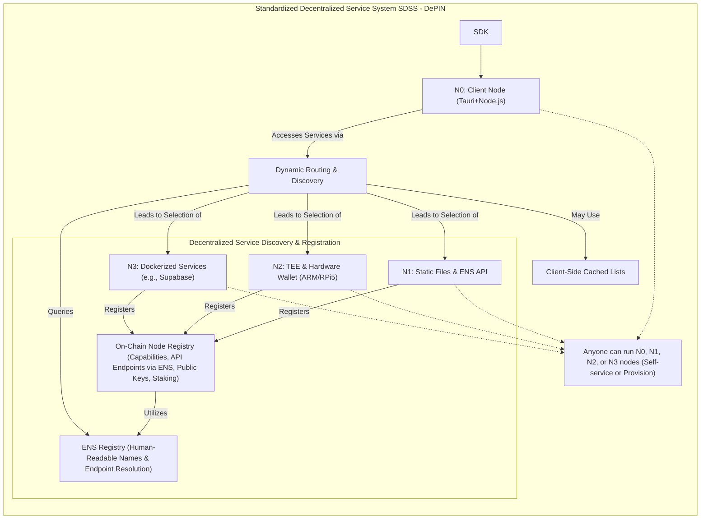

# Standardized Decentralized Service System(SDSS)
We dare to challenge the Cloud Computing cause of censorshiped by the power.
## Why?

So many business services are the core of the blockchain, but where is the value alignment? We say we want build a human digital future.
But it is nothing different with original cloud services: censorshiped by the power.
So we launched this: SDSS proposal and the first product: Rain Computing to explore another way for the future.

## How?
We use ENS and the text record to update all register's domain or ip table with services. Permissionless for all registers with different service registered for V0.1.

## Architecture

**Decentralized Service Discovery and Registration:** This mechanism
   underpins the dynamic operation of the SDSS:
   - **ENS Registry for Service Discovery:** Leverages the Ethereum Name Service
     (ENS) for human-readable naming (e.g., `node.ethpaymaster.eth`) and robust
     service endpoint resolution. Nodes register API endpoints and metadata
     within ENS records, creating a decentralized alternative to centralized
     registries.
   - **Node Registration Mechanism:** Provides a secure, potentially
     pseudonymous (via blockchain address) on-chain registry. Nodes register
     their service capabilities, API endpoints (linked via ENS), and public
     keys. This process may involve staking collateral (e.g., into a
     SuperPaymaster contract) to ensure accountability and security.
   - **Dynamic Routing and Discovery:** Client applications (N0 or dApps)
     dynamically locate suitable API service nodes by querying the ENS-based
     registry (e.g., `api.aastar.eth`) or through client-side cached lists. This
     enables self-maintenance of service records, facilitates failover, and
     allows for node selection based on criteria such as reputation or network
     proximity.




## Components

1. CometENS: including frontend for register and management, and a onchain contract, a relay service to resolve ENS.
    https://github.com/AAStarCommunity/CometENS-frontend
    https://github.com/AAStarCommunity/CometENS-Core/tree/aastar-dev
2. Node Register: a node register service for permissionless register to provide any service.
    https://github.com/AAStarCommunity/nodeRegistry
3. SDSS protocol: A standard service invoke protocol, protocol and data structure.
    https://github.com/AAStarCommunity/SDSS , (this repo)

## Demo
We create a simple demo for SDSS(Rain Computing) on gas payment senarios.
1. Register a node in node registry.
2. Clone a service repo and run, like a single validator or run your own paymaster service with community token.
3. Submit your service with standard data structure:
  ```json
{
    "name": "AAstar SuperPaymaster Config Demo",
    "version": "SDSS V0.1",
    "description": "A decentralized gas sponsor provider node",
    "image": "https://aastar.io/superpaymaster.png",
    "url": "https://aastar.io/superpaymaster",
    "ens": "paymaster.aastar.eth",
    "address": "0x1234567890123456789012345678901234567890",
    "stake": {
        "eth": "1000",
        "aastar": "1000",
        "promise": {
            "duration": "30d",
            "amount": "1000",
            "item": "url/ipfs",
            "token-accept": {
                "eth": "0x0000000000000000000000000000000000000000",
                "astPNTs": "0x1234567890123456789012345678901234567890",
                "USDT": "0x1234567890123456789012345678901234567890",
                "USDC": "0x1234567890123456789012345678901234567890",
                "DAI": "0x1234567890123456789012345678901234567890",
                "WETH": "0x1234567890123456789012345678901234567890"
            },
            "price": {
                "eth": "30",
                "astPNTs": "30",
                "USDT": "30",
                "USDC": "30",
                "DAI": "30",
                "WETH": "30"
            }
        }
    },
    "openpnts": {
        "factory": "0x1234567890123456789012345678901234567890",
        "PNTs": "0x1234567890123456789012345678901234567890",
        "ratio": "ratio.aastar.eth",
        "symbol": "astPNTs"
    },
    "opencards": {
        "factory": "0x1234567890123456789012345678901234567890",
        "nft": "0x1234567890123456789012345678901234567890",
        "ratio": "ratio.aastar.eth",
        "symbol": "astCards"
    },
    "Paymaster config": {
        "token-accept": [{
            "symbol": "astPNTs",
            "address": "0x1234567890123456789012345678901234567890",
            "price": "30"
        }, {
            "symbol": "xPNTs",
            "address": "0x0000000000000000000000000000000000000000",
            "price": "20"
        }],
        "limitation": {
            "daily": "1000",
            "single": "1 ETH"
        }
    }
}

```


